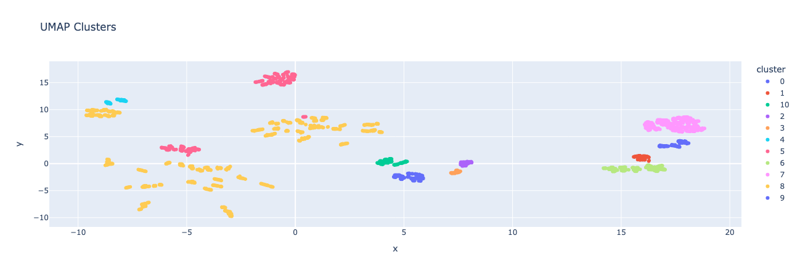
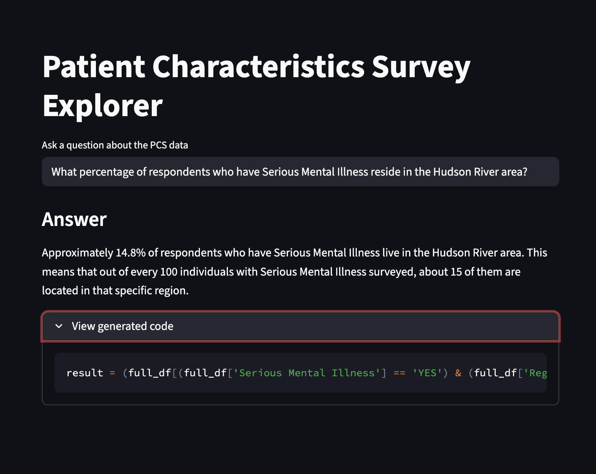

# Medicaid Machine Learning Pipeline

## Project Overview
This project investigates the relationship between Medicaid coverage and Serious Mental Illness (SMI) in New York State. The final paper includes an analysis conducted on Patient Characteristics Survey (PCS) data for the years 2013, 2015, 2017, 2019, and 2022, exploring demographics, employment status, and insurance enrollment trends for individuals receiving mental health services. The primary research interest is identifying how Medicaid enrollment impacts health outcomes for beneficiaries with SMI, particularly in the context of the end of continuous enrollment laws.

## Repository Contents
- Medicaid and Serious Mental Illness.pdf: A comprehensive research paper detailing the history of Medicaid, the prevalence of SMI in New York, and the policy implications of current unwinding laws.
- 01_data_processing.ipynb: Handles data engineering and preparation. It includes custom Python classes to:
  - Automate directory and folder creation.
  - Map categorical values across multi-year datasets into a standardized numerical format.
- 02_HDBSCAN.ipynb: 
  - Embedded 10,000 patient records using OpenAI's text-embedding-3-small
  - Clustered patients using HDBSCAN into 11 meaningful groups
  - Generated clinical summaries for each cluster using GPT-4o-mini



- 03_analysis.ipynb: Performs the core statistical analysis. Key features include:
  - Generating summaries of respondent demographics (SMI prevalence, Medicaid enrollment, SSI assistance).
  - Analyzing employment status by program category (Emergency, Inpatient, Outpatient, etc.).
  - Implementing Instrumental Variable (IV) Regressions to assess the impact of Medicaid on mental health outcomes.
- app.py: Interactive Streamlit app with the following features:
  - Natural Language Query Interface
    - Ask questions in plain English - GPT-4 generates and executes Pandas code in real-time
      - "What percentage of SMI patients are employed?"
      - "Compare Medicaid enrollment rates by survey year"
      - "Show age distribution for inpatient programs"
  - Interactive Dashboard
    - Filter by year and metric to explore demographic trends
  - Geographic Analysis
    - Density heatmaps showing patient distribution and service utilization across NY



## Methodology

### Why Generate Clinical Notes?
Traditional clustering on survey data produces statistically valid but clinically meaningless groups (e.g., "Cluster 3: high on variable_42"). To create interpretable patient archetypes, I:

1. **Synthesized clinical narratives** from structured survey responses
   - Converted demographics, service utilization, insurance status into prose
   - Example: "45-year-old female receiving outpatient services, enrolled in Medicaid, unemployed, diagnosed with SMI"

2. **Created semantic embeddings** using OpenAI's text-embedding-3-small
   - Captures clinical similarity beyond raw feature correlations
   - Patients with similar stories cluster together regardless of feature order

3. **Discovered 11 patient archetypes** using HDBSCAN
   - Density-based clustering finds natural groupings without forcing a predetermined K

4. **Generated interpretable summaries** using GPT-4o-mini
   - Each cluster described in clinical terms
   - Example: "Young adults (18-25) in crisis intervention programs, primarily uninsured"

### Why This Matters
This approach enables:
  - **Clinicians** to understand patient subpopulations without learning ML
  - **Policymakers** to target interventions to specific archetypes
  - **Researchers** to generate hypotheses about differential treatment effects

### Example Generated Clinical Note

**Generated narrative:**
```
Topic Title for Cluster 14: "Outpatient Mental Health Needs of Hispanic Female Children"
Clinical Notes: The cluster of 382 outpatient child patients is predominantly female, aged
between pre-K and high school, with a significant number identifying as Hispanic/Latino.
Most patients are living in private residences, cohabitating with others, and are not
currently in the labor force, indicating a lack of employment opportunities. A notable
characteristic of this group is the presence of serious mental illnesses, with many patients
facing challenges related to their mental health, yet lacking chronic physical health
conditions. This cohort differs from the general mental health population by demonstrating a
higher prevalence of severe mental illnesses without significant comorbid chronic health
issues, suggesting a focused mental health intervention need. Recommended interventions
include tailored outpatient therapy, psychoeducation for families, and coordination of
mental health services to address the unique challenges faced by these children,
particularly in the context of their cultural background and socioeconomic status.
```

## Setup
1. Download PCS survey data from the links below into `data/`
2. Install dependencies: `pip install -r requirements.txt`
3. Run notebooks in order: `01_data_processing.ipynb` → `02_clustering.ipynb` → `03_analysis.ipynb`
4. Launch the app: `streamlit run src/app.py`

## Tech Stack

**ML/AI:** OpenAI API (GPT-4o-mini, text-embedding-3-large), UMAP, HDBSCAN, scikit-learn
**App:** Streamlit, Plotly, Mapbox
**Data:** Pandas, NumPy (750k+ records across 5 years)
**Analysis:** Instrumental Variable Regression, Statistical Modeling

## Key Findings
- SMI Prevalence: Analysis shows a significant increase in adult respondents identified with SMI, rising from approximately 81.7% in 2013 to over 94.5% in 2022.
- Medicaid Enrollment: Enrollment among surveyed adults with SMI has remained relatively stable, hovering around 71–74% across the decade studied.
- Employment Disparities: There is a notable gap in employment for those with SMI; for example, in 2022, only ~33.6% of Outpatient program respondents with SMI were employed, compared to higher unemployment/NILF (Not in Labor Force) rates in other categories.

## Data Source
The data is sourced from the New York State Office of Mental Health (OMH) Patient Characteristics Survey.

Note: Due to the size of the datasets, raw CSV files are not included in this repository but can be found using the following links:

  - https://catalog.data.gov/dataset/patient-characteristics-survey-pcs-2013
  - https://catalog.data.gov/dataset/patient-characteristics-survey-pcs-2015
  - https://catalog.data.gov/dataset/patient-characteristics-survey-pcs-2017
  - https://catalog.data.gov/dataset/patient-characteristics-survey-pcs-2019
  - https://catalog.data.gov/dataset/patient-characteristics-survey-pcs-2022-persons-served-by-survey-year-region-of-provider-g
